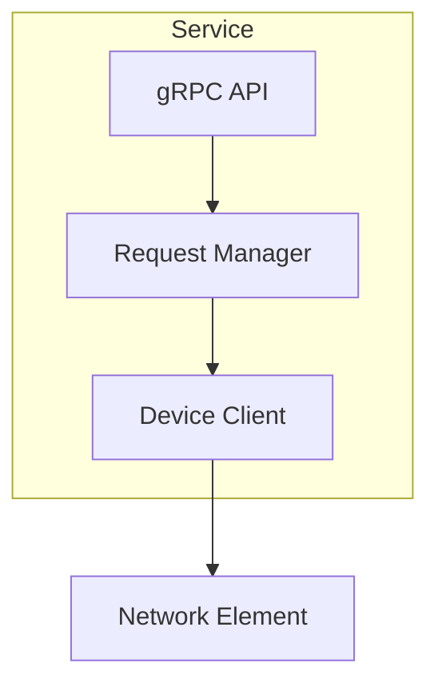
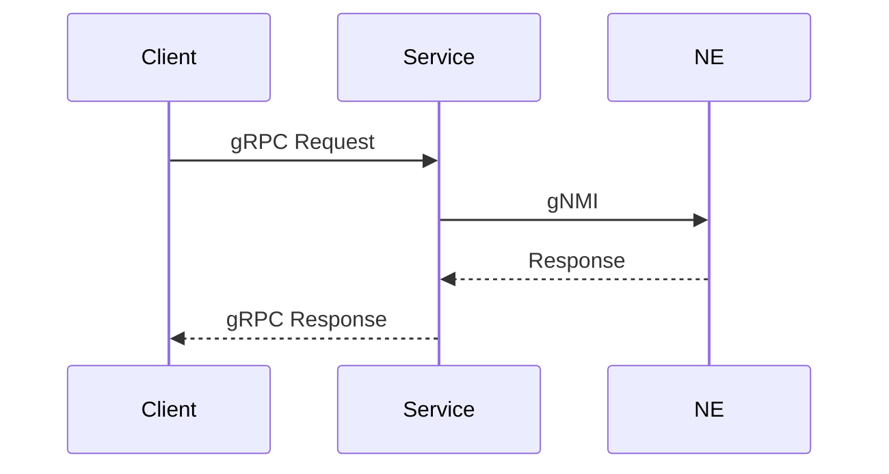

# Create repo arch doc – reference

## HLD chapter structure (arch-docs = Confluence template)

The **arch-docs** HLD directory (`docs/HLD/`) is the single source of truth for section order and intent. It matches the NSP Confluence template (pageId 2162422282).

| Chapter | File | Purpose |
|---------|------|---------|
| Overview | `index.md` | NSP ARCH template intro; contents list (links to 01–12). |
| 1 | `01-architecture-overview.md` | High-level vision, objectives; C1 use cases, C2 how requirements are implemented. |
| 2 | `02-components.md` | Component interactions, new/modified components, flows; C2 flow diagrams. |
| 3 | `03-foss-3pp-components.md` | Third-party and open-source dependencies. |
| 4 | `04-system-dependencies.md` | Dependencies on other NSP systems. |
| 5 | `05-apis.md` | API design, contracts; C1 use cases, C2 specs; internal/external, backward compatibility. |
| 6 | `06-models.md` | Data models and relationships. |
| 7 | `07-data-flow.md` | Data lifecycle, creation/discovery/update/storage; flows between components. **Sequence/flow diagram:** use **draw.io** (rules: `drawio-rules.mdc`). See **Data flow diagram (Ch 7)** below. |
| 8 | `08-security-access-control.md` | Security architecture and access policies. |
| 9 | `09-platform-considerations.md` | Platform considerations (HA, DR, footprint/scaling, deployment). See **Platform considerations (Ch 9)** below. |
| 10 | `10-resource-usage.md` | Resource requirements and estimates. |
| 11 | `11-patents.md` | Patent considerations. |
| 12 | `12-sign-off.md` | Approval and sign-off. |

When a section cannot be filled: keep the heading and add `*TODO: [what to add or who should fill].*`

---

## Table templates per chapter

Use these table formats when filling each section. All examples are drawn from the Device Registry gold-standard reference (`device-registry/docs/actual/System_Design_HighLevel.md`, `device-registry/docs/confluence/body.html`).

### Ch 2 — Components

Bullet list or table listing each major component:

```markdown
- **gRPC server** — RegistryService (read), RegistryConfigService (write), RegistryNotificationService (streaming).
- **HTTP server** — REST API (deprecation planned), health probes, Prometheus /metrics.
- **Storage abstraction** — etcd-backed; NeEntry, MediationPolicy, schema index.
- **RESTCONF client** — Syncs from Device Admin at startup (lazy, diff-based).
- **Kafka consumer** — Real-time events from `nsp-yang-model.change-notif`.
- **Notification broadcaster** — Broadcasts changes to subscribed gRPC clients.
```

### Ch 3 — FOSS/3PP Components

**Verification rule:** Only list packages that the repo **directly imports** (appear in `go.mod` direct require block AND are imported in source). Packages listed as `// indirect` are transitive — note them as such and do NOT imply the repo uses that system. Read the `go.mod` of wrapper libraries (e.g. `comm-client-go`) to trace what they actually depend on; libraries evolve and may have dropped or replaced dependencies.

| Package | Version | Purpose |
|---------|---------|---------|
| `gorilla/mux` | (from go.mod) | HTTP router |
| `rs/zerolog` | (from go.mod) | Structured logging |
| `twmb/franz-go` | (from go.mod) | Kafka consumer (pure Go, no CGO) |
| `go.etcd.io/etcd/client/v3` | (from go.mod) | etcd client |
| `google.golang.org/grpc` | (from go.mod) | gRPC server/client |

### Ch 4 — System Dependencies

**Verification rule:** Before listing a system dependency, confirm it is actively used — not just a transitive artifact. For integration libraries (e.g. `comm-client-go`), read the library's own `go.mod`/`Cargo.toml` to verify the actual downstream systems. A dependency like `rabbitmq/amqp091-go` appearing as `// indirect` does NOT mean the service uses RabbitMQ — the wrapper library may have replaced it with a different mechanism (e.g. `comm-operator-client-protobuf-go` for gRPC dispatch). Always verify before documenting.

| System | Protocol | Config keys | Notes |
|--------|----------|-------------|-------|
| **etcd** | gRPC | `etcd.host.names`, `etcd.service.port`, `etcd.namespace` | Primary storage |
| **Device Admin** | RESTCONF | `restconf_config.json`: `svc`, `port`, `auth_mode` | Optional; startup sync |
| **Kafka** | SSL | `kafka_config.json`: `enabled`, `bootstrap_servers`, `topic` | Optional; real-time events |
| **Discovery Service** | gRPC | — | Optional; registers NEs via gRPC |

### Ch 6 — Models

**Storage types table:**

| Type | Fields | Notes |
|------|--------|-------|
| `NeEntry` | `NeId`, `Addresses[]`, `NeDetails` | One key per NE in etcd |
| `AddressInNe` | `Address`, `Port`, `AddressType`, `Protocol` | Nested in NeEntry |
| `MediationPolicy` | `Username`, `Password`, `DefaultPort`, `Secure`, `Protocol`, `ConnectTimeout`, `ReadTimeout` | Per policyId/protocol |

**Storage key patterns table (etcd):**

| Key pattern | Content | Approx. size |
|-------------|---------|-------------|
| `ne/{neId}` | Full NE JSON | ~350 B |
| `ne/index/address/{address}:{port}` | neId string (reverse lookup) | ~20 B |
| `mediation-policy/{policyId}/{protocol}` | Policy JSON | ~130 B |
| `schema-index/{schema_name}/{schema_version}` | JSON array of ne_type:ne_version | ~300 B |

### Ch 8 — Security and Access Control

**TLS configuration table:**

| Connection | Endpoint | TLS behaviour |
|-----------|----------|---------------|
| Base TLS | (internal) | Full CA verification + client cert (mTLS) |
| System token | `nspos-tomcat-headless-svc:8575` | mTLS + optional `InsecureSkipVerify` |
| RESTCONF HTTP | `nspos-app2-tomcat-svc:443` | `InsecureSkipVerify`, Bearer token |
| Kafka | Broker `nspos-kafka-broker-0:9392` | SSL with `InsecureSkipVerify`, client certs from `tls_config.json` |

### Ch 9 — Platform considerations

| Subsection | C1 / question | C2 / detail |
|------------|----------------|-------------|
| **High Availability (HA)** | How will the architecture provide HA? | How does the architecture provide HA? |
| **Disaster Recovery (DR)** | How will the architecture provide DR? | How does the architecture provide DR? |
| **Footprint and scaling** | How will work be distributed? | How is work distributed? (scale up and down) |
| **Deployment considerations** | — | CAM deployment, HELM deployment, upgrade path, patch update strategy |

Fill each subsection with concrete answers (e.g. stateless replicas, etcd for HA; backup/restore for DR; horizontal scaling; Kustomize/Helm, rolling upgrades).

### Ch 10 — Resource usage

**K8s resources (from kustomize/base/deployment.yaml):**

| Resource | Requests | Limits |
|----------|----------|--------|
| Memory | 300Mi | 2Gi |
| CPU | 0.2 | 2 |

**Subsystem runtime footprint (e.g. Kafka consumer):**

| Resource | Value | Notes |
|----------|-------|-------|
| Goroutines | 9 (fixed) | 1 poll loop + 8 worker pool |
| Memory (steady-state) | ~3–6 MB | Bounded, does not grow with NE count |
| CPU (idle) | ~0% | `PollFetches` blocks |
| CPU (per matched msg) | ~50–200 µs | JSON unmarshal + dispatch + etcd write |
| Network (inbound) | ~1–5 KB/msg | Notification envelope JSON |

**Storage projection (e.g. etcd at 50K NEs):**

| Metric | Projected |
|--------|-----------|
| Scale factor | ~5× (50K / 10K baseline) |
| Projected DB size | ~155 MB |
| Quota usage | ~7.4% of 2.1 GB default |
| Key count | ~125K |

---

## API section structure (Ch 5) — detailed

The API chapter should be the most comprehensive section. Follow the Device Registry pattern (sections 11.1–11.4 in `System_Design_HighLevel.md`) with sub-sections per gRPC service.

### Structure per service

```
## N. Proto API definitions and field abstracts

Source: [../protomsg/<service>.proto](...)

### N.1 <ServiceName> (read/write/notification API)

| RPC | Request | Response | Purpose |
|-----|---------|----------|---------|
| ... | ... | ... | ... |

**Message abstracts (<ServiceName>):**

- **<RequestType>**: `field1` (type), `field2` (type).
- **<ResponseType>**: `field1` (type), `field2` (type).

#### <ComplexRequest> details and sample

| Field | Type | Create (new) | Update (existing) |
|-------|------|--------------|-------------------|
| ... | ... | ... | ... |

**Sample payload (create):**
```json
{ ... }
```

**Sample payload (update):**
```json
{ ... }
```

### N.2 <NextServiceName> ...

### N.3 <NotificationServiceName>

| RPC | Request | Response | Purpose |
|-----|---------|----------|---------|

**Message abstracts:**
- ...

#### Stream notification samples

**Sample: NE CREATE**
```json
{ "event_type": "CREATE", "message_type": "NE", ... }
```

**Sample: MEDIATION_POLICY UPDATE**
```json
{ ... }
```

### N.4 Shared types
- **<SharedType>**: `field1`, `field2`.
```

### Field documentation conventions

| Pattern | When to use |
|---------|-------------|
| `field` (type) | Simple field in message abstracts |
| `field` (type, optional) | Proto optional field |
| `field` (repeated type) | Proto repeated field |
| `field` (oneof: A, B, C) | Proto oneof |
| `field` (map string to string) | Proto map field |

### Sample payload guidelines

- Use JSON representation of gRPC messages.
- Fill all required fields with realistic domain values (e.g. `"ne-001"`, `"192.0.2.10"`, `"srl"`, `"24.10.R1"`).
- For create samples: include all fields. For update samples: include only `id` + changed fields.
- For delete samples: include only the identifier.
- For notification samples: show one per event type (CREATE, UPDATE, DELETE) per message type (NE, MEDIATION_POLICY, SCHEMA).

---

## Configuration section structure

For services with multiple config files, document each:

### Config file table

| JSON field | Default | Description |
|-----------|---------|-------------|
| `svc` | `""` (disabled) | Service hostname; empty = feature disabled |
| `port` | `"8545"` | Service port |
| ... | ... | ... |

### Main configuration table

| Property path | ConfigMap key | Description |
|--------------|---------------|-------------|
| `configs/main/<key>` | `<configmap-key>` | (description) |
| `configs/info/pod.name` | `pod.name` | Pod instance name |

### Shared TLS configuration

| JSON field | Default | Description |
|-----------|---------|-------------|
| `cert_path` | `"/certs/tls.crt"` | Client/server TLS certificate |
| `key_path` | `"/certs/tls.key"` | TLS private key |
| `ca_cert_path` | `"/certs/ca.crt"` | CA certificate |

---

## RESTCONF / external client mapping tables

When the service ingests data from an external source, document the field mapping:

### Source-to-storage mapping

| Source field | Storage field | Notes |
|-------------|---------------|-------|
| `ne-id` | `NeId` | Direct mapping |
| `ne-type` | `NeDetails.NeType` | |
| `version` | `NeDetails.NeVersion` | |
| `active-ip-addresses[0]` | `Addresses[].Address` | First active IP |
| (derived) | `Addresses[].AddressType` | Detected via `net.ParseIP` |

---

## Data flow diagram (Ch 7)

**Sequence diagram (preferred):** Use **draw.io** with the **Sequence diagram (UML)** pattern in `drawio-rules.mdc`: `umlLifeline` participants, time top-to-bottom, elbow vertical messages, yellow/green/gray theme (callers, service, storage). **Flow diagram:** Alternatively use flowchart rules in the same file (naming, colors, vertices before edges).

### Direct draw.io generation (preferred)

Generate `.drawio` XML directly. Do not use Mermaid as an intermediate step — produce the XML file.

**Component diagram structure:**

```xml
<mxfile host="...">
  <diagram id="<repo>-components" name="Components">
    <mxGraphModel dx="1176" dy="812" grid="1" gridSize="10" ...>
      <root>
        <mxCell id="0"/>
        <mxCell id="1" parent="0"/>
        <!-- Container for main service -->
        <mxCell id="container" value="SERVICE NAME" style="rounded=1;whiteSpace=wrap;fontSize=14;fontStyle=1;align=center;fillColor=#e8eef4;strokeColor=#606666;strokeWidth=2;" parent="1" vertex="1">
          <mxGeometry x="..." y="..." width="550" height="270" as="geometry"/>
        </mxCell>
        <!-- Components as children of container -->
        <mxCell id="comp1" value="gRPC Server" style="rounded=1;whiteSpace=wrap;fillColor=#e3f2fd;strokeColor=#1976d2;strokeWidth=2;fontColor=#0d47a1;" parent="container" vertex="1">
          <mxGeometry x="..." y="..." width="120" height="80" as="geometry"/>
        </mxCell>
        <!-- ... more components ... -->
        <!-- External systems as separate groups -->
        <!-- ALL EDGES AFTER ALL VERTICES -->
        <mxCell id="e1" value="label" style="edgeStyle=orthogonalEdgeStyle;strokeColor=#2c5282;strokeWidth=2;labelBackgroundColor=#ffffff;fontColor=#333333;" parent="1" source="..." target="..." edge="1"/>
      </root>
    </mxGraphModel>
  </diagram>
</mxfile>
```

**Sequence diagram structure:**

```xml
<mxfile host="...">
  <diagram id="<repo>-data-flow" name="Data Flow">
    <mxGraphModel dx="1176" dy="812" grid="1" ...>
      <root>
        <mxCell id="0"/>
        <mxCell id="1" parent="0"/>
        <!-- Lifelines (vertices first) -->
        <mxCell id="p1" value="Caller" style="shape=umlLifeline;perimeter=lifelinePerimeter;whiteSpace=wrap;container=1;dropTarget=0;collapsible=0;recursiveResize=0;outlineConnect=0;portConstraint=eastwest;newEdgeStyle={&quot;edgeStyle&quot;:&quot;elbowEdgeStyle&quot;,&quot;elbow&quot;:&quot;vertical&quot;};size=65;fillColor=#ffe6cc;strokeColor=#2c5282;strokeWidth=4;fontColor=#000000;" parent="1" vertex="1">
          <mxGeometry x="40" y="20" width="100" height="520" as="geometry"/>
        </mxCell>
        <mxCell id="p2" value="Service" style="...fillColor=#d5e8d4;..." parent="1" vertex="1">
          <mxGeometry x="160" y="20" width="100" height="520" as="geometry"/>
        </mxCell>
        <mxCell id="p3" value="Storage" style="...fillColor=#e8f4e8;..." parent="1" vertex="1">
          <mxGeometry x="280" y="20" width="100" height="520" as="geometry"/>
        </mxCell>
        <!-- Messages (edges after all lifelines) -->
        <mxCell id="m1" value="request" style="verticalAlign=bottom;edgeStyle=elbowEdgeStyle;elbow=vertical;curved=0;rounded=0;endArrow=block;strokeColor=#2c5282;strokeWidth=2;fontColor=#000000;fillColor=#ffffff;labelBackgroundColor=#ffffff;" parent="1" source="p1" target="p2" edge="1">
          <mxGeometry relative="1" as="geometry">
            <Array as="points"><mxPoint x="..." y="95"/></Array>
          </mxGeometry>
        </mxCell>
        <!-- Self-call (curved) -->
        <mxCell id="m2" value="internal op" style="curved=1;endArrow=block;rounded=0;strokeColor=#2c5282;strokeWidth=2;fontColor=#000000;fillColor=#ffffff;labelBackgroundColor=#ffffff;" parent="1" source="p2" target="p2" edge="1">
          <mxGeometry relative="1" as="geometry">
            <Array as="points">
              <mxPoint x="..." y="155"/>
              <mxPoint x="..." y="185"/>
            </Array>
          </mxGeometry>
        </mxCell>
      </root>
    </mxGraphModel>
  </diagram>
</mxfile>
```

### Reference draw.io file

`device-registry/docs/confluence/diagrams/device_registry_data_flow_v1.drawio` — 6 lifelines (Discovery_Service, Device_Registry, Device_Admin, Kafka, etcd, Clients), 13 messages covering RESTCONF sync, Kafka events, gRPC registration, read/write, watch events, and SubscribeNotifications. Use as the template when generating new data flow diagrams.

### Mermaid in repo HLD (alternative for techdocs)

In repo `docs/HLD/` or `docs/actual/`, Mermaid is acceptable per documentation-guidelines when the doc will be rendered via techdocs/mkdocs. Draw.io is always preferred for Confluence and for the canonical arch doc.

Example Mermaid (component):



Example Mermaid (sequence):



---

## Component-architect agent

- **Path:** `arch-docs/.cursor/agents/component-architect.md`
- **Role:** Build NSP component architecture and generate HLD from a PRD. Does not implement; analyzes options, proposes decisions, produces HLD.
- **Input:** PRD under `docs/PRD/`.
- **Output:** HLD from `docs/HLD/` chapter templates; follow `docs/documentation-guidelines.md`.
- **Use with this skill:** When the user asks for arch generation and a PRD or arch-docs is in scope, use component-architect's workflow (read PRD → fill each HLD chapter → store in repo). This skill defines the chapter structure, Confluence mapping, and repo layout.

## Documentation guidelines (arch-docs)

- **Location:** `arch-docs/docs/documentation-guidelines.md`
- **Backstage / TechDocs:** Publish repo docs per that file; follow mkdocs-oriented structure where specified.
- **mkdocs:** Use paths and navigation conventions from documentation-guidelines.
- **`catalog-info.yaml`:** Register the component; add the **Confluence architecture page** URL under **`metadata.links`** so the wiki and catalog stay aligned.
- **Diagrams:** **Mermaid** in repo markdown (`docs/HLD/`, `docs/actual/`); **draw.io** for Confluence (`docs/confluence/diagrams/`) — same semantics, different format.
- **Living HLD:** Refresh HLD chapters and the Confluence body when behavior, APIs, or dependencies change.

### Confluence page vs HLD template sections

NSP arch Confluence pages should mirror **`arch-docs/docs/HLD/index.md`** (chapters 1–12): Architecture Overview → Sign-Off. When drafting `body.html`, verify every chapter has content or explicit N/A/TODO — not only the cloud-native-heavy sections.

For **reviewing** an existing Confluence arch page against that template, use the **confluence-cloudnative-review** skill (`workspace-settings/.cursor/skills/confluence-cloudnative-review/SKILL.md`), which includes an **HLD template coverage** pass in addition to cloud-native findings.

---

## Links

| Resource | Link / Path |
|----------|-------------|
| Confluence template (do not create under) | https://confluence.ext.net.nokia.com/pages/viewpage.action?pageId=2162422282 |
| Parent for new arch pages | pageId **2069174542** (`--parent-id 2069174542`) |
| Device Registry arch page | https://confluence.ext.net.nokia.com/display/NSPArchEvo/Device+Registry+Arch |
| gNMI Communicator sample | https://confluence.ext.net.nokia.com/display/NSPArchEvo/gNMI+Communicator+Service |
| arch-docs HLD | `arch-docs/docs/HLD/` |
| Device Registry HDD (local) | `device-registry/docs/actual/System_Design_HighLevel.md` |
| Device Registry body (Confluence) | `device-registry/docs/confluence/body.html` |
| Device Registry data flow draw.io | `device-registry/docs/confluence/diagrams/device_registry_data_flow_v1.drawio` |
| Draw.io rules | `workspace-settings/.cursor/rules/drawio-rules.mdc` |
| Confluence scripts | `workspace-settings/.cursor/scripts/` |
| Read template via script | `confluence_read_page.py --page-id 2162422282` |
| Read Device Registry page | `confluence_read_page.py --title "Device Registry Arch" --space-key NSPArchEvo` |
